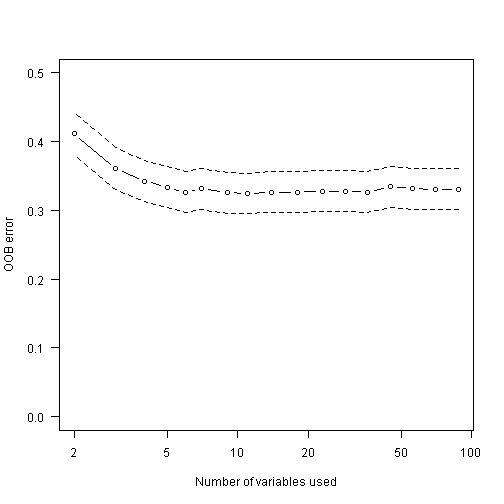

## Main Question: Given that we have a unique combination of novel data, increased computational facilities, and an expanded geographic scope, what can we add to the classic understanding of the processes that are predictive of chlorophyll *a* and trophic state in lakes. 

### Initital variable selection (Jeff)
1.mean temp
2.DD45 
3.Select scale(s) - local - 300m and regional - 3000m
 *ANALYSIS*- as a check look at centroid distance matrix 
4.Turbidity, not secchi - because turb is an instrument measure and not limited by depth of lake.  If need be Turb could be converted to and estimated secchi.


### Analysis 1. Compare classic linear models to random forest models?

1.Chl a ~ TP (converted to TS)
2.Chl a ~ TN (converted to TS)
3.Chl a ~ TN + TP (converted to TS)
4.Chl a ~ Linear Mod with varSelRF variables (converted to TS)


```
## 
## Backwards elimination on random forest; ntree =  10000 ;  mtryFactor =  1 
## 
##  Selected variables:
## [1] "NTL"      "PTL"      "TOC"      "TURB"     "WSA_ECO9"
## 
##  Number of selected variables: 5
```

```
##  Number.Variables Vars.in.Forest          OOB            sd.OOB      
##  Min.   : 2.0     Length:17          Min.   :0.325   Min.   :0.0148  
##  1st Qu.: 6.0     Class :character   1st Qu.:0.327   1st Qu.:0.0148  
##  Median :14.0     Mode  :character   Median :0.331   Median :0.0148  
##  Mean   :25.1                        Mean   :0.337   Mean   :0.0149  
##  3rd Qu.:36.0                        3rd Qu.:0.334   3rd Qu.:0.0149  
##  Max.   :88.0                        Max.   :0.411   Max.   :0.0155
```

 

```
## 
## Call:
## lm(formula = Formula1, data = LMdata)
## 
## Residuals:
##    Min     1Q Median     3Q    Max 
## -4.545 -0.640  0.069  0.747  3.449 
## 
## Coefficients:
##             Estimate Std. Error t value Pr(>|t|)    
## (Intercept)  -4.4982     0.1903   -23.6   <2e-16 ***
## lnNTL         1.0352     0.0293    35.3   <2e-16 ***
## ---
## Signif. codes:  0 '***' 0.001 '**' 0.01 '*' 0.05 '.' 0.1 ' ' 1
## 
## Residual standard error: 1.05 on 1140 degrees of freedom
##   (14 observations deleted due to missingness)
## Multiple R-squared:  0.522,	Adjusted R-squared:  0.522 
## F-statistic: 1.25e+03 on 1 and 1140 DF,  p-value: <2e-16
```

```
## 
## Call:
## lm(formula = Formula2, data = LMdata)
## 
## Residuals:
##    Min     1Q Median     3Q    Max 
## -6.384 -0.544  0.060  0.661  3.240 
## 
## Coefficients:
##             Estimate Std. Error t value Pr(>|t|)    
## (Intercept)  -0.2124     0.0728   -2.92   0.0036 ** 
## lnPTL         0.6971     0.0196   35.49   <2e-16 ***
## ---
## Signif. codes:  0 '***' 0.001 '**' 0.01 '*' 0.05 '.' 0.1 ' ' 1
## 
## Residual standard error: 1.04 on 1140 degrees of freedom
##   (14 observations deleted due to missingness)
## Multiple R-squared:  0.525,	Adjusted R-squared:  0.525 
## F-statistic: 1.26e+03 on 1 and 1140 DF,  p-value: <2e-16
```

```
## 
## Call:
## lm(formula = Formula3, data = LMdata)
## 
## Residuals:
##    Min     1Q Median     3Q    Max 
## -5.137 -0.530  0.079  0.639  3.425 
## 
## Coefficients:
##             Estimate Std. Error t value Pr(>|t|)    
## (Intercept)  -2.8049     0.2246   -12.5   <2e-16 ***
## lnNTL         0.5660     0.0467    12.1   <2e-16 ***
## lnPTL         0.3901     0.0314    12.4   <2e-16 ***
## ---
## Signif. codes:  0 '***' 0.001 '**' 0.01 '*' 0.05 '.' 0.1 ' ' 1
## 
## Residual standard error: 0.983 on 1139 degrees of freedom
##   (14 observations deleted due to missingness)
## Multiple R-squared:  0.579,	Adjusted R-squared:  0.579 
## F-statistic:  784 on 2 and 1139 DF,  p-value: <2e-16
```

```
## 
## Call:
## lm(formula = Formula4, data = LMdata)
## 
## Residuals:
##    Min     1Q Median     3Q    Max 
## -5.579 -0.462  0.072  0.600  3.381 
## 
## Coefficients:
##             Estimate Std. Error t value Pr(>|t|)    
## (Intercept)  -1.8717     0.2552   -7.33  4.2e-13 ***
## lnNTL         0.4746     0.0562    8.44  < 2e-16 ***
## lnPTL         0.0898     0.0350    2.57     0.01 *  
## lnTOC        -0.0151     0.0529   -0.29     0.78    
## lnTURB        0.4939     0.0330   14.97  < 2e-16 ***
## ---
## Signif. codes:  0 '***' 0.001 '**' 0.01 '*' 0.05 '.' 0.1 ' ' 1
## 
## Residual standard error: 0.898 on 1137 degrees of freedom
##   (14 observations deleted due to missingness)
## Multiple R-squared:  0.649,	Adjusted R-squared:  0.648 
## F-statistic:  527 on 4 and 1137 DF,  p-value: <2e-16
```


5.Chl a TS ~ RF(varSelRF variables) - single randomForest run
6.Chl a TS ~ Random Forest Consensus - single randomForest run

*ANALYSIS*
- varSelRF (Bryan plus play with varSelRFBoot)
- run linear models (1-4) (Bryan)
- run RF (Betty)
 - randomForest All Variables
 - randomForest varSelRF Variables
- output error matrices (Bryan, Betty and Jeff)
 - overall accuracy
 - Kappa


### Question 2. Are *in situ* nutrient and water quality data required to make predicitions of trophic state or can GIS derived information on lake and land use/land cover also provide quality predictions?

**Predict for these classes**
1. NLA Chl a trophic state classes
2. High/Low trophic state classes

### Question3. Can data-mining approaches identify new, interesting variables to use for the prediction of trophic state?


## Here's the analysis part:

### Initial Variable Culling:

This set of code creates namesets needed to cull out the initial set of variables


## Chl *a* Trophic Status ~ All Variables + Landscape Percent


## Chl *a* Trophic Status ~ GIS Only Variables +Landscape Percent


