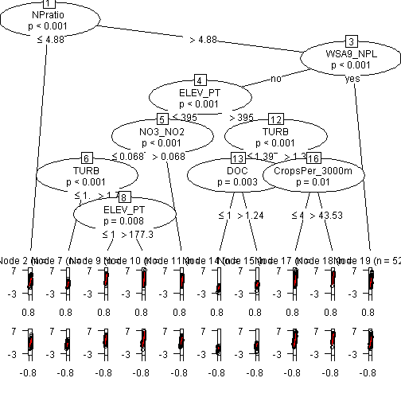

## Main Question: Given that we have a unique combination of novel data, increased computational facilities, and an expanded geographic scope, what can we add to the classic understanding of the processes that are predictive of chlorophyll *a* and trophic state in lakes. 

### Initital variable selection (Jeff)
1.mean temp
2.DD45 
3.Select scale(s) - local - 300m and regional - 3000m
 *ANALYSIS*- as a check look at centroid distance matrix 
4.Turbidity, not secchi - because turb is an instrument measure and not limited by depth of lake.  If need be Turb could be converted to and estimated secchi.


### Analysis 1. Compare classic linear models to random forest models?

1.Chl a ~ TP (converted to TS)
2.Chl a ~ TN (converted to TS)
3.Chl a ~ TN + TP (converted to TS)
4.Chl a ~ Linear Mod with varSelRF variables (converted to TS)

use varSelRF to select the variables for linear model 4


```
## [1] "RF of all variables with both 300m and 3000m  percent nlcd"
```

```
## 
## Backwards elimination on random forest; ntree =  10000 ;  mtryFactor =  1 
## 
##  Selected variables:
## [1] "K"        "NPratio"  "NTL"      "PTL"      "TOC"      "TURB"    
## [7] "WSA_ECO9"
## 
##  Number of selected variables: 7
```

```
##  Number.Variables Vars.in.Forest          OOB            sd.OOB      
##  Min.   : 2.0     Length:17          Min.   :0.323   Min.   :0.0142  
##  1st Qu.: 6.0     Class :character   1st Qu.:0.332   1st Qu.:0.0143  
##  Median :14.0     Mode  :character   Median :0.338   Median :0.0144  
##  Mean   :25.1                        Mean   :0.341   Mean   :0.0144  
##  3rd Qu.:36.0                        3rd Qu.:0.341   3rd Qu.:0.0144  
##  Max.   :88.0                        Max.   :0.402   Max.   :0.0149
```

```
## [1] "RF of all variables with only the 300m percent nlcd"
```

```
## 
## Backwards elimination on random forest; ntree =  10000 ;  mtryFactor =  1 
## 
##  Selected variables:
## [1] "K"        "NPratio"  "NTL"      "ORGION"   "PTL"      "TOC"     
## [7] "TURB"     "WSA_ECO9"
## 
##  Number of selected variables: 8
```

```
##  Number.Variables Vars.in.Forest          OOB            sd.OOB      
##  Min.   : 2.00    Length:16          Min.   :0.323   Min.   :0.0142  
##  1st Qu.: 5.75    Class :character   1st Qu.:0.331   1st Qu.:0.0143  
##  Median :13.50    Mode  :character   Median :0.332   Median :0.0143  
##  Mean   :21.81                       Mean   :0.339   Mean   :0.0144  
##  3rd Qu.:31.75                       3rd Qu.:0.343   3rd Qu.:0.0144  
##  Max.   :71.00                       Max.   :0.399   Max.   :0.0149
```

```
## [1] "RF of all variables with only the 3000m percent nlcd"
```

```
## 
## Backwards elimination on random forest; ntree =  10000 ;  mtryFactor =  1 
## 
##  Selected variables:
## [1] "K"        "NPratio"  "NTL"      "ORGION"   "PTL"      "TOC"     
## [7] "TURB"     "WSA_ECO9"
## 
##  Number of selected variables: 8
```

```
##  Number.Variables Vars.in.Forest          OOB            sd.OOB      
##  Min.   : 2.00    Length:16          Min.   :0.326   Min.   :0.0143  
##  1st Qu.: 5.75    Class :character   1st Qu.:0.329   1st Qu.:0.0143  
##  Median :13.50    Mode  :character   Median :0.335   Median :0.0144  
##  Mean   :21.81                       Mean   :0.340   Mean   :0.0144  
##  3rd Qu.:31.75                       3rd Qu.:0.343   3rd Qu.:0.0144  
##  Max.   :71.00                       Max.   :0.396   Max.   :0.0149
```

```
## [1] "RF of GIS variables with both 300m and 3000m  percent nlcd"
```

```
## 
## Backwards elimination on random forest; ntree =  10000 ;  mtryFactor =  1 
## 
##  Selected variables:
## [1] "AlbersX"            "AlbersY"            "CropsPer_3000m"    
## [4] "DEPTHMAX"           "EvergreenPer_3000m" "EvergreenPer_300m" 
## [7] "WSA_ECO9"          
## 
##  Number of selected variables: 7
```

```
##  Number.Variables Vars.in.Forest          OOB            sd.OOB      
##  Min.   : 2.0     Length:15          Min.   :0.485   Min.   :0.0148  
##  1st Qu.: 5.5     Class :character   1st Qu.:0.491   1st Qu.:0.0148  
##  Median :11.0     Mode  :character   Median :0.493   Median :0.0148  
##  Mean   :17.3                        Mean   :0.503   Mean   :0.0148  
##  3rd Qu.:24.5                        3rd Qu.:0.516   3rd Qu.:0.0148  
##  Max.   :54.0                        Max.   :0.536   Max.   :0.0148
```

```
## [1] "RF of GIS variables with only 300m percent nlcd"
```

```
## 
## Backwards elimination on random forest; ntree =  10000 ;  mtryFactor =  1 
## 
##  Selected variables:
## [1] "AlbersX"           "AlbersY"           "CropsPer_300m"    
## [4] "DEPTHMAX"          "EvergreenPer_300m" "WSA_ECO9"         
## 
##  Number of selected variables: 6
```

```
##  Number.Variables Vars.in.Forest          OOB            sd.OOB      
##  Min.   : 2.0     Length:13          Min.   :0.483   Min.   :0.0148  
##  1st Qu.: 5.0     Class :character   1st Qu.:0.492   1st Qu.:0.0148  
##  Median :10.0     Mode  :character   Median :0.507   Median :0.0148  
##  Mean   :13.5                        Mean   :0.507   Mean   :0.0148  
##  3rd Qu.:19.0                        3rd Qu.:0.521   3rd Qu.:0.0148  
##  Max.   :37.0                        Max.   :0.537   Max.   :0.0148
```

```
## [1] "RF of GIS variables with only 3000m percent nlcd"
```

```
## 
## Backwards elimination on random forest; ntree =  10000 ;  mtryFactor =  1 
## 
##  Selected variables:
##  [1] "AlbersX"            "AlbersY"            "BASINAREA"         
##  [4] "CropsPer_3000m"     "DDs45"              "DeciduousPer_3000m"
##  [7] "DEPTHMAX"           "DevOpenPer_3000m"   "ELEV_PT"           
## [10] "EvergreenPer_3000m" "HerbWetPer_3000m"   "MaxDepthCorrect"   
## [13] "MeanDepthCorrect"   "ShrubPer_3000m"     "WSA_ECO9"          
## 
##  Number of selected variables: 15
```

```
##  Number.Variables Vars.in.Forest          OOB            sd.OOB      
##  Min.   : 2.0     Length:13          Min.   :0.473   Min.   :0.0148  
##  1st Qu.: 5.0     Class :character   1st Qu.:0.495   1st Qu.:0.0148  
##  Median :10.0     Mode  :character   Median :0.499   Median :0.0148  
##  Mean   :13.5                        Mean   :0.504   Mean   :0.0148  
##  3rd Qu.:19.0                        3rd Qu.:0.516   3rd Qu.:0.0148  
##  Max.   :37.0                        Max.   :0.531   Max.   :0.0148
```


```
## lnCHLA ~ lnNTL
```

```
## 
## Call:
## lm(formula = Formula, data = LMall)
## 
## Residuals:
##    Min     1Q Median     3Q    Max 
## -4.550 -0.634  0.070  0.742  3.447 
## 
## Coefficients:
##             Estimate Std. Error t value Pr(>|t|)    
## (Intercept)  -4.5032     0.1899   -23.7   <2e-16 ***
## lnNTL         1.0364     0.0293    35.4   <2e-16 ***
## ---
## Signif. codes:  0 '***' 0.001 '**' 0.01 '*' 0.05 '.' 0.1 ' ' 1
## 
## Residual standard error: 1.04 on 1141 degrees of freedom
##   (5 observations deleted due to missingness)
## Multiple R-squared:  0.523,	Adjusted R-squared:  0.523 
## F-statistic: 1.25e+03 on 1 and 1141 DF,  p-value: <2e-16
```

```
## [1] 1.09
```

```
## lnCHLA ~ lnPTL
```

```
## 
## Call:
## lm(formula = Formula, data = LMall)
## 
## Residuals:
##    Min     1Q Median     3Q    Max 
## -6.387 -0.545  0.058  0.657  3.238 
## 
## Coefficients:
##             Estimate Std. Error t value Pr(>|t|)    
## (Intercept)  -0.2106     0.0727    -2.9   0.0039 ** 
## lnPTL         0.6972     0.0196    35.5   <2e-16 ***
## ---
## Signif. codes:  0 '***' 0.001 '**' 0.01 '*' 0.05 '.' 0.1 ' ' 1
## 
## Residual standard error: 1.04 on 1141 degrees of freedom
##   (5 observations deleted due to missingness)
## Multiple R-squared:  0.525,	Adjusted R-squared:  0.525 
## F-statistic: 1.26e+03 on 1 and 1141 DF,  p-value: <2e-16
```

```
## [1] 1.085
```

```
## lnCHLA ~ lnNTL + lnPTL
```

```
## 
## Call:
## lm(formula = Formula, data = LMall)
## 
## Residuals:
##    Min     1Q Median     3Q    Max 
## -5.134 -0.532  0.088  0.634  3.424 
## 
## Coefficients:
##             Estimate Std. Error t value Pr(>|t|)    
## (Intercept)  -2.8154     0.2242   -12.6   <2e-16 ***
## lnNTL         0.5688     0.0466    12.2   <2e-16 ***
## lnPTL         0.3888     0.0313    12.4   <2e-16 ***
## ---
## Signif. codes:  0 '***' 0.001 '**' 0.01 '*' 0.05 '.' 0.1 ' ' 1
## 
## Residual standard error: 0.981 on 1140 degrees of freedom
##   (5 observations deleted due to missingness)
## Multiple R-squared:  0.58,	Adjusted R-squared:  0.58 
## F-statistic:  788 on 2 and 1140 DF,  p-value: <2e-16
```

```
## [1] 0.96
```

```
## lnCHLA ~ lnNTL + lnPTL + lnTOC + lnTURB + lnK + lnNPratio
```

```
## 
## Call:
## lm(formula = Formula, data = LMall)
## 
## Residuals:
##    Min     1Q Median     3Q    Max 
## -5.702 -0.461  0.068  0.604  3.358 
## 
## Coefficients:
##              Estimate Std. Error t value Pr(>|t|)    
## (Intercept)   -1.5141     0.2622   -5.78  9.9e-09 ***
## lnNTL          0.4684     0.0572    8.19  6.7e-16 ***
## lnPTL          0.1471     0.0355    4.14  3.7e-05 ***
## lnTOC          0.0270     0.0533    0.51     0.61    
## lnTURB         0.4735     0.0326   14.52  < 2e-16 ***
## lnK           -0.1234     0.0278   -4.44  9.9e-06 ***
## lnNPratioyes  -0.4113     0.0818   -5.03  5.8e-07 ***
## ---
## Signif. codes:  0 '***' 0.001 '**' 0.01 '*' 0.05 '.' 0.1 ' ' 1
## 
## Residual standard error: 0.882 on 1136 degrees of freedom
##   (5 observations deleted due to missingness)
## Multiple R-squared:  0.662,	Adjusted R-squared:  0.66 
## F-statistic:  371 on 6 and 1136 DF,  p-value: <2e-16
```

```
## [1] 0.7729
```

```
## lnCHLA ~ lnNTL + lnPTL + lnTOC + lnTURB + lnK + lnNPratio + WSA9_CPL + 
##     WSA9_NAP + WSA9_UMW + WSA9_TPL + WSA9_SPL + WSA9_XER + WSA9_NPL + 
##     WSA9_SAP
```

```
## 
## Call:
## lm(formula = Formula, data = LMall)
## 
## Residuals:
##    Min     1Q Median     3Q    Max 
## -4.915 -0.431  0.043  0.516  2.664 
## 
## Coefficients: (1 not defined because of singularities)
##              Estimate Std. Error t value Pr(>|t|)    
## (Intercept)   -1.5332     0.2505   -6.12  1.3e-09 ***
## lnNTL          0.4555     0.0536    8.50  < 2e-16 ***
## lnPTL          0.1465     0.0332    4.41  1.1e-05 ***
## lnTOC          0.0776     0.0522    1.49  0.13718    
## lnTURB         0.4215     0.0309   13.63  < 2e-16 ***
## lnK           -0.0291     0.0300   -0.97  0.33258    
## lnNPratioyes  -0.6262     0.0981   -6.38  2.5e-10 ***
## WSA9_CPLyes    0.3754     0.1069    3.51  0.00046 ***
## WSA9_NAPyes   -0.2629     0.1075   -2.45  0.01463 *  
## WSA9_UMWyes   -0.4422     0.1052   -4.20  2.8e-05 ***
## WSA9_TPLyes   -0.1025     0.1035   -0.99  0.32241    
## WSA9_SPLyes   -0.4740     0.1056   -4.49  7.9e-06 ***
## WSA9_XERyes   -0.8716     0.1146   -7.60  6.0e-14 ***
## WSA9_NPLyes   -1.2626     0.1411   -8.95  < 2e-16 ***
## WSA9_SAPyes        NA         NA      NA       NA    
## ---
## Signif. codes:  0 '***' 0.001 '**' 0.01 '*' 0.05 '.' 0.1 ' ' 1
## 
## Residual standard error: 0.807 on 1129 degrees of freedom
##   (5 observations deleted due to missingness)
## Multiple R-squared:  0.719,	Adjusted R-squared:  0.716 
## F-statistic:  222 on 13 and 1129 DF,  p-value: <2e-16
```

```
## [1] 0.643
```


5.Chl a TS ~ RF(varSelRF variables) - single randomForest run
6.Chl a TS ~ Random Forest Consensus - single randomForest run

*ANALYSIS*
- varSelRF (Bryan plus play with varSelRFBoot)
- run linear models (1-4) (Bryan)
- run RF (Betty)
 - randomForest All Variables
 - randomForest varSelRF Variables
- output error matrices (Bryan, Betty and Jeff)
 - overall accuracy
 - Kappa
 
 

```
## Loading required package: party
```

```
## Warning: package 'party' was built under R version 3.0.3
```

```
## Loading required package: grid
## Loading required package: zoo
```

```
## Warning: package 'zoo' was built under R version 3.0.3
```

```
## 
## Attaching package: 'zoo'
## 
## The following objects are masked from 'package:base':
## 
##     as.Date, as.Date.numeric
## 
## Loading required package: sandwich
```

```
## Warning: package 'sandwich' was built under R version 3.0.3
```

```
## Loading required package: strucchange
```

```
## Warning: package 'strucchange' was built under R version 3.0.3
```

```
## Loading required package: modeltools
## Loading required package: stats4
```

 

```
##           PercentImperv_300m WaterPer_300m IceSnowPer_300m DevOpenPer_300m
## statistic              7.704          4.51           3.491         13.5400
## p.value                1.000          1.00           1.000          0.9989
##           DevLowPer_300m DevMedPer_300m DevHighPer_300m BarrenPer_300m
## statistic            6.9        18.0015         20.3611          6.635
## p.value              1.0         0.6653          0.3946          1.000
##           DeciduousPer_300m EvergreenPer_300m MixedForPer_300m
## statistic           16.3810             9.781            8.866
## p.value              0.8848             1.000            1.000
##           ShrubPer_300m GrassPer_300m PasturePer_300m CropsPer_300m
## statistic         5.853         2.904           7.231       12.9251
## p.value           1.000         1.000           1.000        0.9998
##           WoodyWetPer_300m HerbWetPer_300m PercentImperv_3000m
## statistic            7.553           7.455               10.87
## p.value              1.000           1.000                1.00
##           WaterPer_3000m IceSnowPer_3000m DevOpenPer_3000m DevLowPer_3000m
## statistic          7.587             3.82          14.3492           11.23
## p.value            1.000             1.00           0.9929            1.00
##           DevMedPer_3000m DevHighPer_3000m BarrenPer_3000m
## statistic         13.4265          14.2742             4.3
## p.value            0.9992           0.9939             1.0
##           DeciduousPer_3000m EvergreenPer_3000m MixedForPer_3000m
## statistic            21.8869              7.301              11.2
## p.value               0.2015              1.000               1.0
##           ShrubPer_3000m GrassPer_3000m PasturePer_3000m CropsPer_3000m
## statistic        13.4685          8.927            9.637          7.859
## p.value           0.9991          1.000            1.000          1.000
##           WoodyWetPer_3000m HerbWetPer_3000m AlbersX   AlbersY  LakeArea
## statistic           18.1176            11.12 15.1290 3.440e+01 31.159980
## p.value              0.6472             1.00  0.9731 5.923e-04  0.002794
##           LakePerim ShoreDevel BASINAREA DEPTHMAX   ELEV_PT DO2_2M
## statistic 37.441849   28.34929  25.52221 24.92714 30.691965  11.26
## p.value    0.000136    0.01051   0.03896  0.05116  0.003488   1.00
##           PH_FIELD  COND     ANC      TURB  TOC   DOC     NH4 NO3_NO2   CL
## statistic    12.55 7.965 25.8639 4.331e+01 6.38 8.832 17.3204   5.377 8.85
## p.value       1.00 1.000  0.0333 7.618e-06 1.00 1.000  0.7677   1.000 1.00
##             NO3   SO4    CA      MG    Na       K COLOR  SIO2    H    OH
## statistic 4.071 6.791 11.51 15.5063 9.834 16.4149 11.98 4.509 8.92 9.518
## p.value   1.000 1.000  1.00  0.9549 1.000  0.8813  1.00 1.000 1.00 1.000
##            NH4ION CATSUM ANSUM2 ANDEF2  SOBC BALANCE2 ORGION CONCAL2
## statistic 23.1174  8.146  7.696   4.03 8.146    3.212  7.921   8.127
## p.value    0.1162  1.000  1.000   1.00 1.000    1.000  1.000   1.000
##           CONDHO2    TmeanW    DDs45 MaxLength  MaxWidth MeanWidth
## statistic   9.679 3.675e+01 25.28700 32.135327 3.654e+01 3.580e+01
## p.value     1.000 1.901e-04  0.04339  0.001756 2.111e-04 3.017e-04
##              FetchN  FetchNE    FetchE  FetchSE MaxDepthCorrect
## statistic 3.421e+01 26.11316 32.283856 26.11316         14.3957
## p.value   6.492e-04  0.02968  0.001636  0.02968          0.9923
##           VolumeCorrect MeanDepthCorrect NPratio WSA9_WMT  WSA9_CPL
## statistic     3.610e+01          14.2783 23.1162    4.498 3.274e+01
## p.value       2.612e-04           0.9939  0.1163    1.000 3.370e-05
##           WSA9_NAP  WSA9_UMW WSA9_TPL WSA9_SPL WSA9_XER WSA9_NPL WSA9_SAP
## statistic   7.2872 3.157e+01   0.8126    2.383    5.937        0   6.9469
## p.value     0.9976 5.922e-05   1.0000    1.000    1.000       NA   0.9991
```

```
## [1] 0.5608
```

```
## 'log Lik.' -1131 (df=49)
```

```
## [1] 2361
```


### Question 2. Are *in situ* nutrient and water quality data required to make predicitions of trophic state or can GIS derived information on lake and land use/land cover also provide quality predictions?

**Predict for these classes**
1. NLA Chl a trophic state classes
2. High/Low trophic state classes

### Question3. Can data-mining approaches identify new, interesting variables to use for the prediction of trophic state?


## Here's the analysis part:

### Initial Variable Culling:

This set of code creates namesets needed to cull out the initial set of variables


## Chl *a* Trophic Status ~ All Variables + Landscape Percent


## Chl *a* Trophic Status ~ GIS Only Variables +Landscape Percent


